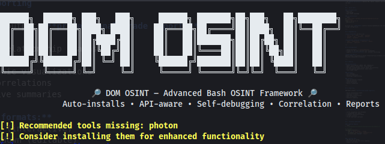
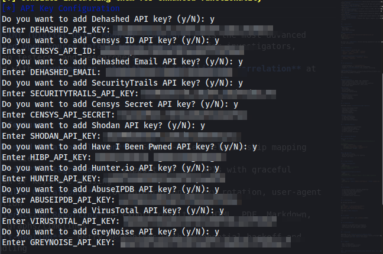
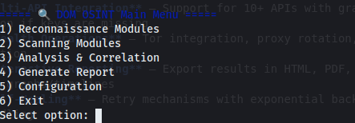

# 🔎 DOM-OSINT Framework  






> **DOM-OSINT (Digital OSINT Modular Framework)** is the most advanced **Bash-based Open Source Intelligence framework** for investigators, penetration testers, and researchers.  
> Designed with **automation, stealth, and intelligence correlation** at its core.  

---

## ✨ Key Features  

- 🔗 **Advanced Data Correlation** – SQLite-based relationship mapping between entities  
- 🌐 **Multi-API Integration** – Support for 10+ APIs with graceful degradation if keys are missing  
- 🕵️ **Stealth Operations** – Tor integration, proxy rotation, user-agent randomization  
- 📊 **Interactive Reporting** – Export results in HTML, PDF, Markdown, JSON with graphs/timelines  
- 🧩 **Modular Architecture** – Simple plugin system for adding new modules and APIs  
- 📡 **Pivoting Workflows** – Automatically connect domains → emails → IPs → leaks → social profiles  
- 🧠 **Entity Extraction** – Detects IPs, emails, domains, and links in raw data  

---

## 🚀 Quick Start  

### ✅ Prerequisites  
- Bash 4.0+  
- Linux/macOS  
- Basic OSINT knowledge  

### 📥 Installation  
```bash
git clone https://github.com/yourusername/dom-osint.git
cd dom-osint
chmod +x dom-osint.sh
./dom-osint.sh
```

On first run, **DOM-OSINT** installs missing dependencies and walks you through configuration.  

---

## 📦 Dependencies  

**Auto-installed** on first run:  
- `curl`, `jq`, `whois`, `dig`, `exiftool`  
- `sqlite3`, `tor`, `torsocks`, `python3`  
- `pandoc`, `graphviz`  

**Recommended (enhanced functionality):**  
- `nmap`, `theHarvester`, `recon-ng`, `photon`  
- `dnsrecon`, `sublist3r`  

---

## 🔧 Configuration  

- Config directory: `~/.config/domosint/`  
- Prompts for API keys (optional but recommended)  
- Supports **stealth profiles** (Tor, proxies, throttling)  

**Supported APIs:**  
HIBP · Shodan · VirusTotal · Censys · SecurityTrails · Hunter.io · Dehashed · AbuseIPDB · GreyNoise  

---

## 🧩 Modules  

### Reconnaissance  
- Domain investigation (WHOIS, DNS, subdomains)  
- Email analysis (breach data, verification)  
- Username reconnaissance (social media, dev platforms)  
- IP investigation (geolocation, abuse check)  
- Phone number OSINT  

### Scanning  
- Port scanning  
- Service enumeration  
- Technology fingerprinting  

### Analysis  
- Data correlation & mapping  
- Timeline analysis  
- Entity extraction  
- Pattern recognition  

---

## 📊 Reporting  

DOM-OSINT outputs **professional-grade reports**:  

- Entity relationship graphs  
- Timelines of events  
- Geographic visualizations  
- Data correlations  
- Executive summaries  

**Export formats:**  
- 📄 HTML (interactive)  
- 📝 Markdown (editable)  
- 📑 PDF (print-ready)  
- 🔧 JSON (machine-readable)  

---

## 🛡️ Stealth Features  

- 🔒 Tor integration with fallback  
- 🎭 Randomized user agents  
- ⏳ Request throttling & delays  
- 🔄 Proxy rotation  
- 🚦 API rate-limit awareness  

---

## 🔌 Extending DOM-OSINT  

### ➕ Add New Modules  
```bash
# ~/.config/domosint/modules/reconnaissance/new_module.sh

#!/bin/bash
new_module_function() {
    read -p "Enter target: " target
    run_module "Module Name" "command_to_run"
    correlate_data "$target" "result"
}
```  

### ➕ Add New APIs  
- Add API key in config  
- Write API function with error handling  
- Respect rate limits  

---

## 🧪 Usage Examples  

**Domain Investigation**  
```bash
./dom-osint.sh
# Recon → Domain Investigation
# Target: example.com
```  

**Automated Investigation Chain**  
```bash
./dom-osint.sh
# Automated chain: domain → emails → IPs → leaks → profiles
```  

**Run a Single Module**  
```bash
./dom-osint.sh --module domain_investigation --target example.com
```  

---

## 🗺️ Roadmap  

- 🤖 AI-powered analysis & pattern recognition  
- 🌑 Dark web monitoring integration  
- 📡 Real-time team collaboration  
- 📱 Mobile companion app  
- 🗺️ Geospatial analysis  
- 🧬 ML-based entity recognition  

---

## 🤝 Contributing  

We welcome contributions!  

```bash
git checkout -b feature/amazing-feature
git commit -m "Add amazing feature"
git push origin feature/amazing-feature
```
Then open a **Pull Request**.  

---

## 📝 License  

Licensed under **MIT**. See [LICENSE](LICENSE).  

---

## 🙏 Acknowledgments  

- Inspired by top OSINT tools & frameworks  
- Thanks to the open-source OSINT community  
- API providers who make research possible  

---

## ⚠️ Disclaimer  

DOM-OSINT is for **ethical security research only**.  
Users must ensure proper authorization before running investigations.  
The developers are **not liable** for misuse.  

---

## 📞 Support  

- Open a GitHub Issue  
- Join our Discord (link in Wiki)  
- Check the Wiki documentation  

---

### 🚀 DOM-OSINT – Because Reconnaissance Should Be Smart, Fast, and Powerful.
